# Keyestudio ESP32 Easy Coding Board


------------------


## 1. Description

Keyestudio ESP32 Easy Coding Board is equipped with 520KB dynamic memory, 4MB flash memory and 240MHz dual-core processor to easily run a variety of real-time operating systems, like freeRTOS. Besides, its low-power Bluetooth and WiFi capabilities are excellent for wireless communication.

This board also integrates a variety of sensors on its board: The temperature and humidity sensor monitors ambient temperature and humidity in real time; The six-axis acceleration gyroscope obtains motions and acceleration; The ambient light sensor captures ambient light intensity; The SD card interface saves the detected data; The microphone detects ambient sound, and the buzzer plays music; Buttons A and B, 7 touch keys on the board can be used as switches; 5x5 RGB dot matrix displays numbers, letters and patterns with stepless dimming.

Therefore, it is widely applided to STEAM teaching, IoT, intelligent control projects, and a variety of DIY creative works.

------------


----------------


----------------

ESP32 board is welded with gold-finger expansion pins, including all IO pins, 19 digital ports, 7 analog ports, I2C, UART and SPI interfaces.


This board is compatible with a variety of programming languages, including Arduino, MicroPython and graphical programming KidsBlock3.0, and development environment of multiple boards. It is suitable for users with different programming levels.

-----------

**Compared ESP32 Easy Coding Board with Micro:bit**

|                       |                                                |                                               |
| :-------------------: | :----------------------------------------------------------: | :----------------------------------------------------------: |
|         Name          |                   ESP32 Easy Coding Board                    |                         Micro:bit V2                         |
|    Suitable crowd     |            Primary, junior high, **senior high**             |                     Primary, junior high                     |
|       Processor       |                       **ESP-WROOM-32**                       |                        nRF52833-QIAA                         |
|      Dimensions       |                           52*51mm                            |                           52*43mm                            |
|    Memory capacity    |                 **SRAM:520KB<br>Flash:4MB**                  |                  SRAM:16KB<br/>Flash:256KB                   |
| Programming languages |             KidsBlock3.0<br>C/C++<br>microPython             |             JavaScript<br/>C/C++<br/>microPython             |
|       I/O ports       | digital I/O pins: 19<br>analog input pins: 6<br>**PWM pins: 13** |        digital I/O pins: 19<br/>analog input pins: 6         |
|     Communication     |   a. low-consumption Bluetooth 4.2<br>**b. wireless Wifi**   |                low-consumption Bluetooth 4.2                 |
|   Onboard function    | a. 2-channel button<br>b. **7-channel touch input**<br/>c. 3-axis acceleration<br/>d. 3-axis gyroscope<br/>e. light sensor<br/>f. **5x5 RGB dot matrix**<br/>g. **temperature&humidity sensor**<br>h. **SD card slot**<br/>i. **passive buzzer**<br/>j. **microphone**<br/>k. **Power detection**<br/>l. **I2C interface (2.54 pin headers)** | a. 2-channel button<br/>b. 3-channel touch input<br/>c. 3-axis acceleration<br/>d. 3-axis magnetometer<br/>e. light sensor<br/>f. 5x5 LED dot matrix<br/>g. temperature sensor |
|     Introductory      |                            ★★★★★                             |                            ★★★★★                             |
|    Practicability     |                            ★★★★★                             |                              ★★                              |
|     Expansibility     |                             ★★★★                             |                             ★★★                              |

---------


## 2. Technical Specifications

- Power supply: USB power; DC power(PH2.0); gold-finger I/O port power
- Operating voltage: 3.3V
- Operating current: 100mA
- ESP32 main control: 
  - Processor: ESP32-D0WDQ6 (dual-core)
  - Basic frequency: up to 240MHZ
  - SRAM:520KB
  - Flash:4MB
  - WiFi protocol: 802.11 b/g/n (802.11n, fast to 150 Mbps)
  - WiFi operating frequency range: 2412 ~ 2484 MHz
  - Bluetooth protocol: meet Bluetooth v4.2BR /EDR and BLE standards
  - Bluetooth RF: NZIF receiver with -97 dBm sensitivity
  - Bluetooth audio: CVSD and SBC audio
- Onboard resources:
  - 2-channel digital buttons (A and B buttons)
  - MPU6050 six-axis acceleration gyroscope
    - Maximum rotation speed: 2000°/s
    - Acceleration range: ±2g，±4g，±8g，±16g
  - Light sensor: phototransistor ALS-PT19-315C
  - Microphone: 4013-SMD
  - Buzzer: MLT-8530AAC3V
  - 25 RGB: WS2812-2020 RGB-LED
  - Temperature and humidity sensor: AHT20
  - SD card expansion interface
  - Power of supply detection module: INA180A1IDBVR
  - I2C expansion port (2.54 pin headers)
- Extension interface:
  - 19-channel digital I/O port (partially multiplexed with on-board resources)
  - two 8-bit DAC (io25, io26)
  - 7 touch pins (io2, io4, io12, io13, io15, io27, io32)
  - 13 PWM pins (io2, io4, io5, io12, io15, io16, io18, io19, io23, io25, io26, io27, io32)
  - 3-way UART device (any pin), support for hardware flow control and DMA
  - 2 I2C devices (any pin), support host or slave mode
  - IR remote control (any pin) 8-channel IR transceiver, support different waveform standards.

------------


## 3. Programming Methods

### 1. Arduino:


#### Download Arduino IDE

##### A.Windows System

Step 1: You could download Arduino IDE from the official website：[https://www.arduino.cc/](https://www.arduino.cc/)

Step 2: Enter the link and click **SOFTWARE**:


Step 3: There are various versions of IDE for Arduino. Just download a version compatible with your system. Here we will show you how to download and install the windows version of Arduino IDE. 

Tap “**Windows** win 10 and newer 64 bits” 


Step 4: You just need to click **JUST DOWNLOAD**.


Step 5: After the download is complete, we will get the .exe file, as shown below:


Step 6：Right-click “arduino-ide_2.2.1_Windows_64bit.exe” and tap “**Open**”.


Step 7：Tap “**I Agree**”.


Step 8：Tap “**Next**”


Step 9：First click ① "**Browse..**" to set the installation path of Arduino IDE, then click ② "**Install**".


Step 10：Wait for installation to complete.


Step 11：Click “**Run Arduino IDE**” and “**Finish**”.


##### B. MAC System

Just download a version compatible with your computer system.


####  Install CH340 Driver

##### Windows System

Download: [https://fs.keyestudio.com/CH340-WINDOWS](https://fs.keyestudio.com/CH340-WINDOWS)

Windows 10 (and later systems) boasts their own drivers, so there is no need to install additional drivers.

Connect the control board to your computer.

Click Computer-- Properties -- Device Manager, as shown below. This indicates a successful connection, so the installation of driver is not required. 


If the following situation occurs, you need to manually install the driver.


Click to select “Update driver”. And then the driver will start to install. 


Tap "Browse my computer for drivers".


Find the file **usb_ch341_3.1.2009.06** or **cp210x** you have downloaded, and click "Next".

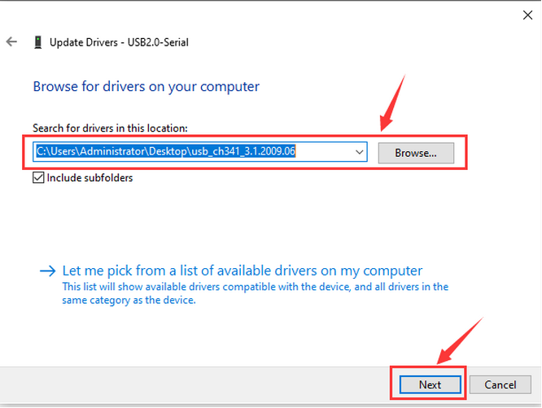

After finishing installing, click "Close" and the serial port number will show up. 


The driver is successfully installed!

Click Computer-- Properties -- Device Manager to check: 


##### MAC System

**Step 1**: Download the driver from the Website and extract the file to the local installation directory.

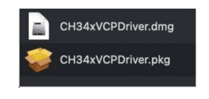

**Step 2**: For details about how to install the driver in pkg format by default, see Step 3. If OS X 11.0 or later does not support Rosetta, refer to Step 4 to install the dmg driver.

Before installation, please forward to “System Preferences” -> “Security & Privacy” -> “General” page, below the title “Allow apps downloaded from:” choose the choice 2 -> “Mac App Store and identified developers”, then the driver will work normally.


**Step 3**: To install the driver in pkg format, tap the driver file → Continue→ Install


Then the installation will be successful.


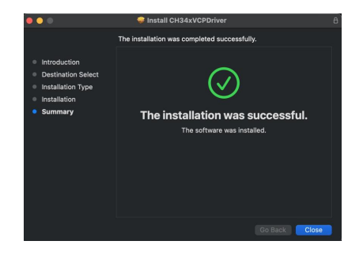

To install the pkg format driver on OS X 11.0 and later: Open “LaunchPad” → “CH34xVCPDriver” → Install.


When using OS X 10.9 to OS X 10.15, click “Restart” to restart your computer, and perform the following steps after the restart.


**Step 4**: To install the dmg driver, tap the dmg file and drag “CH34xVCPDriver” to enter the application folder in the operating system.


Then open “LaunchPad” → “CH34xVCPDriver” → Install.


Then the installation will be successful.

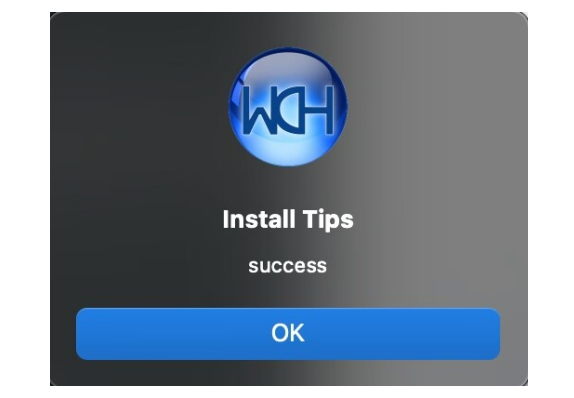

When inserting the CH340 control board into the USB port, open System Report -> Hardware ->USB. On the right is USB Device Tree. If the USB device is working properly, you will find a device whose “Vendor ID” is [0x1a86].


Open “Terminal” program under Applications-Utilities folder and type the command “ls /dev/tty*”.


You should see the “tty.wchusbserialx” where “x” is the assigned device number similar to Windows COM port assignment.

------

#### Windows Arduino IDE ESP32 Development Board

##### Windows

Typically, we cannot find ESP32 board from “Board” in “Tools”. Because we have not install this board on Arduino IDE yet.

Here are the procedures of ESP32 board installation:

Open Arduino IDE.

Click “**Arduino IDE** ——>**Preferences**”. 

Copy the link of ESP32 board (https://espressif.github.io/arduino-esp32/package_esp32_index.json) to Additional boards manager URLs, and tap OK.


Click the icon of "Board Manager" to check for boards.

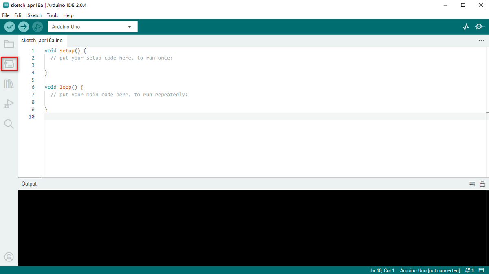

In the search bar, type in ESP32 and search to install the latest version. Then you just need to wait a few minutes for the installation to complete. 

**During installing, please ensure the stability of network. If it fails, please operate last step again to re-install.**


After installation, select the right board model.


Choose the correct COM port.

If there are so many ports that you have no idea which is the correct one, you may unplug the board to check which one disappears. If there is no COM port, please check whether the driver is installed.

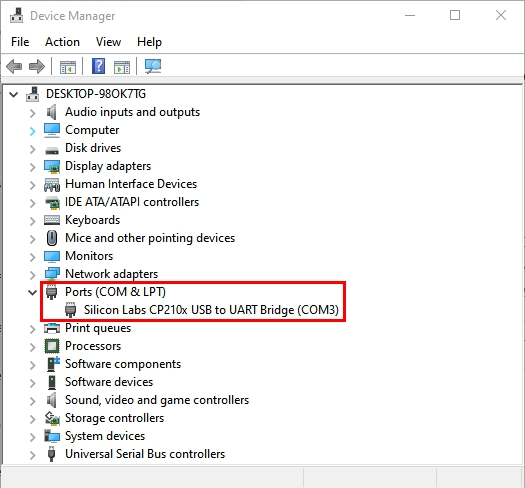


In our demostration, the port is COM3, so we click “Tools” to choose “COM3” in “Port”.


If your board is successfully connected, it will show on the interface. Now you can try to upload code. An examples code is provided here: it will print “Hello Keyestudio!” per second.

Copy and paste the following code to Arduino IDE: 

```c
/*
  keyestudio 
  Print “Hello Keyestudio!”
  http://www.keyestudio.com
*/
void setup() {  
    // put your setup code here, to run once:
    Serial.begin(9600);  //Set the serial port baud rate to 9600
}

void loop() {  
    // put your main code here, to run repeatedly:
    Serial.println("Hello Keyestudio!");  //Serial port printing
 	delay(1000);  //Delay of 1 second
}
```


Click to compile the code. If it succeeds, the following two show up:


While uploading, if it outputs “————……..————……..”, please press and hold “**Boot**” button on your board. However, this only works for Keyestudio ESP32 development board (Keyestudio Plus ESP32 is excluded).

Click and set baud rate to 9600, and “Hello Keyestudio!” are being printed!

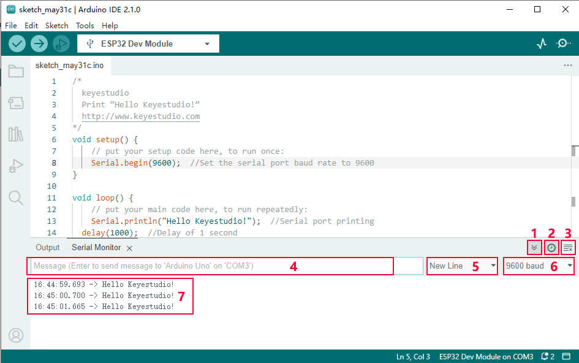

1. “Toggle Autoscroll”: To set whether to follow the print.
2. “Toggle Timestamp”: To set whether to display printing time.
3. “Clear Output”: To clear the output data.
4. Serial Input
5. Serial port sending format
6. Baud rate: To set the baud rate.
7. Printing box.

This is the end of how to upload code!

Now please import libraries for IDE, otherwise an error will occur. 

------

##### MAC

Here are the procedures of ESP32 board installation:

Open Arduino IDE.

Click “**Arduino IDE** ——>**Preferences**”. 

Copy the link of ESP32 board (https://espressif.github.io/arduino-esp32/package_esp32_index.json) to Additional boards manager URLs, and tap OK.


Click the icon of "Board Manager" to check for boards.


In the search bar, type in ESP32 and search to install the latest version. Then you just need to wait a few minutes for the installation to complete. 

**During installing, please ensure the stability of network. If it fails, please operate last step again to re-install.**

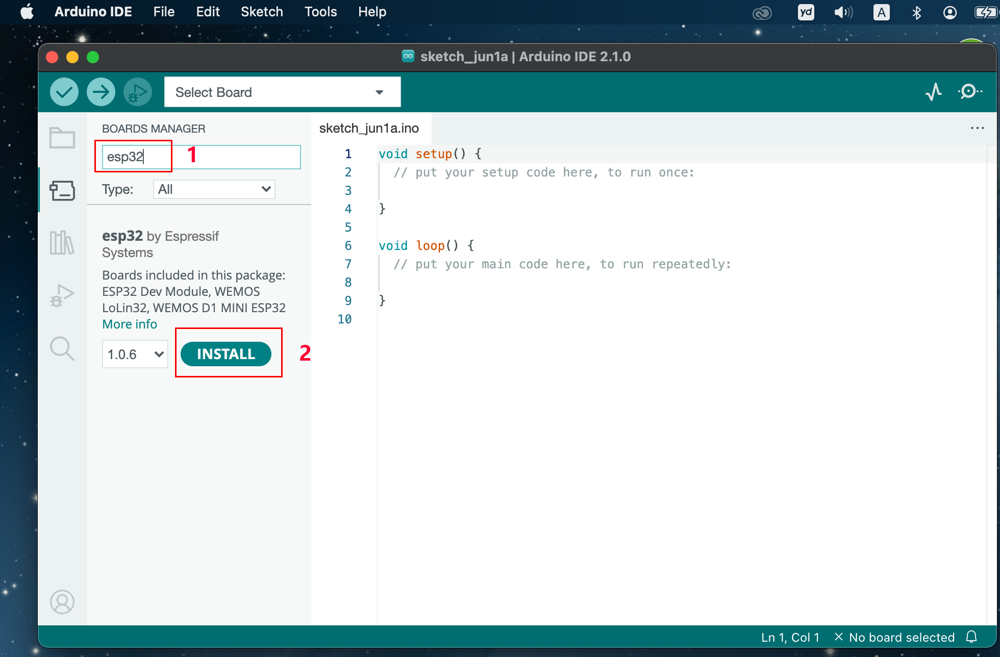

It is successfully installed! 


After installation, select the right board model.


Choose the correct COM port.

If there are so many ports that you have no idea which is the correct one, you may unplug the board to check which one disappears. If there is no COM port, please check whether the driver is installed.

In “Tools”, click “Port” to select “/dev/cu.usbderial-0001”.


If your board is successfully connected, it will show on the interface. 

Now you can try to upload code. An examples code is provided here: it will print “Hello Keyestudio!” per second.


Copy and paste the following code to Arduino IDE: 

```c
/*
  keyestudio 
  Print “Hello Keyestudio!”
  http://www.keyestudio.com
*/
void setup() {  
    // put your setup code here, to run once:
    Serial.begin(9600);  //Set the serial port baud rate to 9600
}

void loop() {  
    // put your main code here, to run repeatedly:
    Serial.println("Hello Keyestudio!");  //Serial port printing
 	delay(1000);  //Delay of 1 second
}
```

Click  to compile the code. If it succeeds, the following two show up:


While uploading, if it outputs “————……..————……..”, please press and hold “**Boot**” button on your board. However, this only works for Keyestudio ESP32 development board (Keyestudio Plus ESP32 is excluded).

Click  and set baud rate to 9600, and “Hello Keyestudio!” are being printed!


1. “Toggle Autoscroll”: To set whether to follow the print.
2. “Toggle Timestamp”: To set whether to display printing time.
3. “Clear Output”: To clear the output data.
4. Serial Input
5. Serial port sending format
6. Baud rate: To set the baud rate.
7. Printing box.

This is the end of how to upload code!

Now please import libraries for IDE, otherwise an error will occur. 


------

### 2. MicroPython:


#### Download and Install Thonny：

Thonny is a free and open source software platform with small size, simple interface, simple operation and rich functions. It is a Python IDE suitable for beginners. In this tutorial, we use this IDE to develop a ESP32. Thonny supports multiple operating systems including Windows, Mac OS, Linux.

##### Download Thonny：

1). Enter the website：[https://thonny.org](https://thonny.org) to download the latest version of Thonny.

2). Thonny open-source code library：[https://github.com/thonny/thonny](https://github.com/thonny/thonny).

<table class="colwidths-auto docutils align-default">
<tbody>
<tr class="odd">
<td>System</td>
<td>Download link</td>
</tr>
<tr class="even">
<td>MAC OS：</td>
<td><a href="https://github.com/thonny/thonny/releases/download/v3.2.7/thonny-3.2.7.pkg">https://github.com/thonny/thonny/releases/download/v3.2.7/thonny-3.2.7.pkg</a></td>
</tr>
<tr class="odd">
<td>Windows：</td>
<td><a href=" https:/github.com/thonny/thonny/releases/download/v3.2.7/thonny-3.2.7.exe">https://github.com/thonny/thonny/releases/download/v3.2.7/thonny-3.2.7.exe</a></td>
</tr>
<tr class="even">
<td>Linux：</td>
<td><p>Latest version:</p>
<p><strong>Binary bundle for PC (Thonny+Python):</strong></p>
<p>bash &lt;(wget -O - https://thonny.org/installer-for-linux)</p>
<p><strong>With pip:</strong></p>
<p>pip3 install thonny</p>
<p><strong>Distro packages (may not be the latest version):</strong></p>
<p><strong>Debian, Rasbian, Ubuntu, Mint and others:</strong></p>
<p>sudo apt install thonny</p>
<p><strong>Fedora:</strong></p>
<p>sudo dnf install thonny</p></td>
</tr>
</tbody>
</table>


##### Install Thonny (Windows System):

1). The downloaded Thonny icon is as follows:


2). Double-click“thonny-3.3.13.exe”and select install mode. You can choose 


3). You can also keep selecting **Next** to finish install.


4). If you want to change the route of installing Thonny，just click“**Browse...**”to select a new route and click **OK**.


5). Click **Create desktop icon,** you will view Thonny on your desktop.


6). Click“**Install**”


7). Wait for a while but don’t click **Cancel**


8). Click **“Finish”**


##### Basic Setting：

Double-click Thonny, choose lanuage and initial settings and click **Let’s go！**

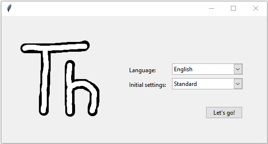


Click“**View**”→“**File**”and“**Shell**”


####  Install CH340 Driver

##### Windows System

Download: [https://fs.keyestudio.com/CH340-WINDOWS](https://fs.keyestudio.com/CH340-WINDOWS)

Windows 10 (and later systems) boasts their own drivers, so there is no need to install additional drivers.

Connect the control board to your computer.

Click Computer-- Properties -- Device Manager, as shown below. This indicates a successful connection, so the installation of driver is not required. 


If the following situation occurs, you need to manually install the driver.


Click to select “Update driver”. And then the driver will start to install. 


Tap "Browse my computer for drivers".


Find the file **usb_ch341_3.1.2009.06** or **cp210x** you have downloaded, and click "Next".


After finishing installing, click "Close" and the serial port number will show up. 


The driver is successfully installed!

Click Computer-- Properties -- Device Manager to check: 


##### MAC System

**Step 1**: Download the driver from the Website and extract the file to the local installation directory.


**Step 2**: For details about how to install the driver in pkg format by default, see Step 3. If OS X 11.0 or later does not support Rosetta, refer to Step 4 to install the dmg driver.

Before installation, please forward to “System Preferences” -> “Security & Privacy” -> “General” page, below the title “Allow apps downloaded from:” choose the choice 2 -> “Mac App Store and identified developers”, then the driver will work normally.


**Step 3**: To install the driver in pkg format, tap the driver file → Continue→ Install


Then the installation will be successful.


To install the pkg format driver on OS X 11.0 and later: Open “LaunchPad” → “CH34xVCPDriver” → Install.


When using OS X 10.9 to OS X 10.15, click “Restart” to restart your computer, and perform the following steps after the restart.


**Step 4**: To install the dmg driver, tap the dmg file and drag “CH34xVCPDriver” to enter the application folder in the operating system.


Then open “LaunchPad” → “CH34xVCPDriver” → Install.


Then the installation will be successful.


When inserting the CH340 control board into the USB port, open System Report -> Hardware ->USB. On the right is USB Device Tree. If the USB device is working properly, you will find a device whose “Vendor ID” is [0x1a86].


Open “Terminal” program under Applications-Utilities folder and type the command “ls /dev/tty*”.


You should see the “tty.wchusbserialx” where “x” is the assigned device number similar to Windows COM port assignment.

#### Burn Micropython firmware

To run a Python program on the ESP32 board, we need to burn the firmware to the ESP32 board first.
##### Download Micropython firmware
microPython website：http://micropython.org/
ESP32 firmware：https://micropython.org/download/esp32/


The firmware we use：esp32-20210902-v1.17.bin

Download firmware：https://micropython.org/resources/firmware/esp32-20210902-v1.17.bin

This firmware is also provided in the folder：


##### Burn the Micropython firmware
Connect the ESP32 to your PC with a USB cable


Make sure the driver has been installed successfully and the COM port can be identified correctly. Open Device Manager and  expand “Ports”.


1. Open Thonny，click“run”and“Select interpreter...”


2. Select Micropython (ESP32) and USB-SERIAL CH340 (COM283) and click “Install or update firmware”.


3. Select“USB-SERIAL CH340 (COM283)”，click “ Browse...”and choose the firmware esp32-20210902-v1.17.bin. Check“Erase flash before installing”and“Flash mode”，then click“Install”.
（(Note：if you fail to install the firmware，press the Boot button on the ESP32 board and click“Install”）


4. Then click Close and OK


5. Turn off all windows and turn to the main page and click“STOP“.


#### Test Code
##### Test the Shell commander
Input print('hello world') in the“Shell”and press Enter


##### Run the test code(online)
Connect the ESP32 to your PC. Users can program and debug programs with Thonny.
1. Open Thonny and click Open.


2. When a new window pops up, click“This computer”


In the new interface, select the file "code Hello World".


Click“Hello World”will be printed in the“Shell”monitor.


Note: Press the reset button to reboot

##### Run the test code(offline)
After rebooting the ESP32, run the boot.py file under the root directory first then run your code file.
So, we need to add a guide program to run the code of users.
1. Move the folder code Hello World to the disk(D), the path is“D:/code Hello World”.
Open Thonny.


2. Click code Hello World Boot. In folder code Hello World in Disk D. 
Double-click boot.py, then the code under MicroPython device can run offline.


If you want to run the code offline, you nee to upload boot.py and program code to MicroPython device, then press the ESP32’s reset button. We will take the code Hello World as an example. Select boot.py and right-click Upload to /.


Similarly, upload the code Hello World.py file to the “MicroPython device”.


3. Press the Reset button, you will view code running in the Shell monitor


------

### 3. KidsBlock3.0:


#### Installation

##### Windows System

1. Download:

   - Click to download: [http://xiazai.keyesrobot.cn/KidsBlock.exe](http://xiazai.keyesrobot.cn/KidsBlock.exe)

   - Or find the software we provided: 

     

2. After downloading, click to open “KidsBlock.exe”

3. Tick “**Anyone who uses this computer(all users)**” and click “**Next**”.


4. Click “**Browse...**” to choose an installation path of the software, and click “**Install**”.


5. click “Finish”.

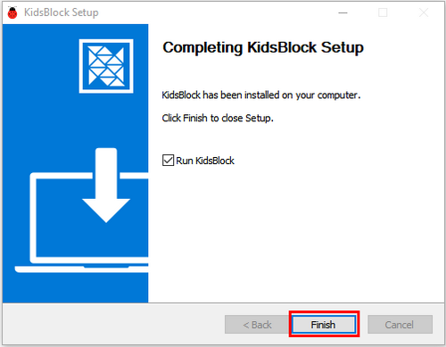

6. Here is the main interface of Kidsblock. If there is a warningin your computer, just click “**Allow access**” to enter the software.


------

##### MacOS

1. Download Kidsblock package: [http://xiazai.keyesrobot.cn/KidsBlock.dmg](http://xiazai.keyesrobot.cn/KidsBlock.dmg)


2. After downloading, click **KidsBlock**. And then drag the **KidsBlock Desktop** into **Applications**.


3. After installation, you can see the icon of KidsBlock.

   

4. Open KidsBlock, but it cannot be opened, because Mac devices is set that they only allow to open apps from its App store by default. Thus, we need to modify some settings.

   

5. Open settings and enter **Privacy&Security**, tick **App Store and identified developers** in **Security**. And then click **Open Anyway**. 

   

6. Click **Open** and the software can be opened. 

   

7. Now re-open the Kidsblock.

   

8. Now enjoy your programming!

   

------


#### Using Tutorial

**We demonstrate on Windows, and MacOS users may take as a referance.**

##### Kidsblock Toolbar


------

##### Language

Click  to shift languages: 

------

##### Device Driver

**If the driver is already installed on the computer, you do not need to install another one. If not, you need to do the following.**

- click  to choose “**Install driver**”.


- Enter **Device Driver Installation Wizard** and click “**Next**”.


- “**Finish**”.


- “**Next**”.


- “**Finish**”.


- If a warning appears, just click “**Allow**” and “**Install**”.


- “**Finish**”.


- “**Extract**”.


- “**Next**”.


- Tick “**I accept this agreement**” and click “**Next**”.

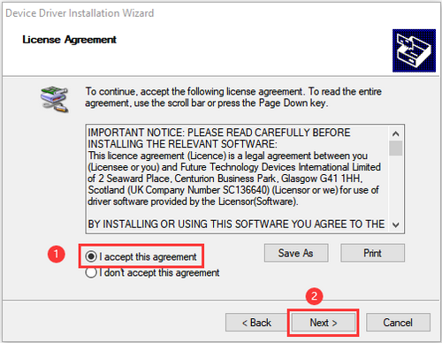

- “**Finish**”.


- Click “**INSTALL**”.


- After the driver is installed, click “**OK**”.


------

##### Board

Connect a board and a port:

- Click  to choose a device. 

- Click **Kit** and find **ESP32 Easy Coding Board** to load it. Required sensors and modules are included in it so you do not need to load them one by one.

  

- The following interface will appear, and we need to choose the correct port and click **Connect**.

  

- **Go to Editor**

  

- The main interface:

  

------

Disconnect:

- Click  and **Disconnect**.

	

------

##### Kidsblock Main Interface Functions


------

##### Extensions

**This kit has been integrated required sensors and modules so does not need to be additionally loaded. If you want to add them that are not available in the kit, please refer to these steps.**

- Click  to choose an extension: 

	

- For instance, if you want to load a passive buzzer, click it:

  

- When “**Not loaded**” becomes “**Loaded**”, the buzzer module is successfully imported. 

  

- Click  and you can see a passive buzzer in the blocks: 

  

- For how to remove the mosule, click  first.

- Click the passive buzzer.

  


- When you see “Loaded” changes into “Not loaded”, the module is removed from blocks.

	


------

##### Open Code

1. Method One:

   - Click SB3 file to open it. If you want to open , just double click to directly open it. After that, please connect to board and port.

     

2. Method Two:

   - Open Kidsblock and click “**file**” to choose “**Load from your computer**”

     

   - Find and open the SB3 file, like 

     

     

------

##### Upload Code

- Load code  to Kidsblock.

- Connect the board to your computer. If there is no port, please install driver first. Choose the correct board and port and click 

  

- Wait for uploading.

  

------

##### Set Baud Rate

- Click one of  to set the size of print box.
  - Small: 
  - Large: 
  - None: 

- After opening print box, click  to set baud rate: 


------

After setting the baud rate and uploading the code, “**Hello KidsBlock**” will be printed on the box.


------
